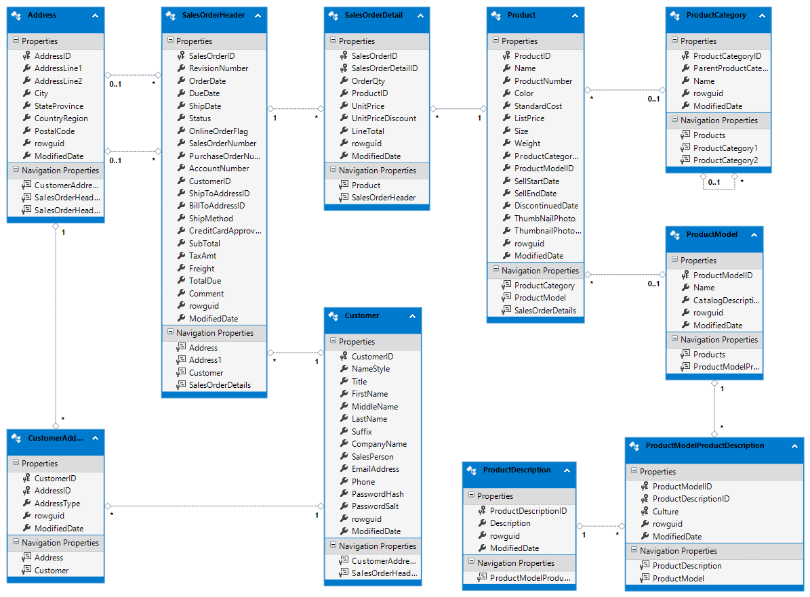

# Creating an OData-compliant REST API in C#

## Table of Contents

-   <a href="#introduction">Introduction</a>
-   <a href="#implementation">Implementing the the REST API</a>
-   <a href="#interaction">Interacting with the REST API</a>
-   <a href="#interpretation">Interpretation of the Results</a>

<a id="introduction"></a>
## Introduction

The primary goal of this project was to create an OData-compliant [[1]] REST
API for Microsoft's SQL Server sample database AdventureWorks [[2]]. The
implementation steps that were necessary to create such an API in C# will be
shown in the first part of this documentation, <a href="#implementation">Implementing the REST API</a>.

In the second part of the documentation, <a href="#interaction">Interacting with the REST API</a>,
the implemented API will be used to showcase some of the main features of OData,
while the third and final part of the documentation, <a href="#interpretation">Interpretation of the Results</a>,
contains some personal impressions from the research and development work that
was done during the creation of this application and documentation as well as
a short discussion of the current state of OData in general and its relation to
HATEOAS concepts.

<a id="implementation"></a>
## Implementing the REST API

Implementation of the OData API for the AdventureWorks database (full picture
of the database structure below) turned out to require far less manual coding
work than originally anticipated. This is in large part due to the "convention
over configuration" mindset that the used OData framework "RESTier" [[4]] is
following as well as the code generation capabilities that Visual Studio
provides, which enable the automated creation of Entity Data Model classes
from an existing SQL Server database.



A step-by-step setup guide can be found on the OData GitHub website [[5]]. The
instructions basically boil down to:

1.  setup the AdventureWorks database,
1.  create a new ASP.NET Web Application with Web API enabled,
1.  generate the Entity Data Model classes from the database,
1.  install the Microsoft.Restier NuGet package,
1.  add 5 lines of code to the WebApiConfig.

Once that's done, just run IIS and the more-or-less fully-featured and
OData-compliant API with access to all the basic query, insert, update and
delete routes for all of the database tables is ready to go.

Since this seems almost too good to be true, let's take at least a bit of a
closer look at the magic lines of code from step 5 that build the whole OData
API around the generated Entity Data Model classes:

```csharp
public static class WebApiConfig
{
    public static async void Register(HttpConfiguration config)
    {
        config.Filter().Expand().Select().OrderBy().MaxTop(null).Count();
        await config.MapRestierRoute<EntityFrameworkApi<AdventureWorksLT>>(
            "AdventureWorksLT", // routeName
            "api/AdventureWorksLT", // routePrefix
            new RestierBatchHandler(GlobalConfiguration.DefaultServer));
    }
}
```

<a id="implementation-query-options"></a>
The `config.Filter()...` line enables the use of the OData system query options
$filter, $expand, $select, $orderby, $top and $count [[6]] by setting the
corresponding properties of the underlying configuration object. By default,
query options are disabled, since some of them can be rather resource hungry,
especially for larger data sets, and therefore might negatively impact the
performance of the whole REST service or even open the door for denial-of-service
attacks from malicious actors [[7]]. A more granular configuration of query
options can be achieved through the use of Model Bound Attributes [[8]] such
as `[Filter("Name")]`, which would enable filtering only for the the "Name"
property of the model to which the attribute is added. Examples on how to use
the query options will be shown in the <a href="#interaction">Interacting with
the REST API</a> section of this documentation.

The `await config.MapRestierRoute<EntityFrameworkApi<AdventureworksLT>>(...)`
line tells RESTier which models it should include in the REST API. RESTier can
retrieve this information from the `AdventureWorksLT` class, which was generated
from the AdventureWorks database in step 3 of the setup process and looks like
the following:

```csharp
public partial class AdventureWorksLT : DbContext
{
    ...

    public virtual DbSet<Customer> Customers { get; set; }
    
    ...

    protected override void OnModelCreating(DbModelBuilder modelBuilder)
    {
        ...

        modelBuilder.Entity<Customer>()
            .HasMany(e => e.CustomerAddresses)
            .WithRequired(e => e.Customer)
            .WillCascadeOnDelete(false);

        modelBuilder.Entity<Customer>()
            .HasMany(e => e.SalesOrderHeaders)
            .WithRequired(e => e.Customer)
            .WillCascadeOnDelete(false);
            
        ...
    }
}
```

For the `Customer` class from the code snippet above, RESTier would define,
among others, a `~/Customers` route which provides access to all (or, with
query options, a subset of all) customers, a `~/Customers({id})` route to access
specific customers, as well as `~/Customers({id})/CustomerAddresses` and
`~/Customers({id})/SalesOrderHeaders` routes for accessing the customer
addresses and sales order headers that are related to specific customers.

The routing conventions used by RESTier are quite similar to the ones that are
described in the OData Web API documentation [[9]] and of course also follow
the official OData URL Conventions [[10]]. However, since RESTier cannot use
individual controllers for each model (which is what is recommended when not
using RESTier), it funnels all requests through a single `RestierController`
that accepts all routes and then makes its further routing and processing
decisions based on the URL path that was accessed.

More information about the OData features that are supported by RESTier and
further details on RESTier's routing logic, including ways to override and
extend RESTier's default routing behaviour, can all be found in the
corresponding sections of the RESTier documentation [[11]].

A final detail that isn't mentioned in RESTier's setup guide, but becomes
relevant rather quickly when adding additional OData routes (taken from the
OData section of Microsoft's ASP.NET Web API documentation [[12]]): typical IIS
configurations don't usually allow `.` in the URL path, causing a 404 error to
be returned when one is included in URLs such as `~/Products(1)/ProductService.Rate`,
which is quite common when using OData functions or actions (more on functions
and actions in the next section of the documentation). To resolve this, the
`system.webServer` configuration in the `Web.config` file can be changed to
the following:

```xml
<system.webServer>
    <handlers>
        <clear/>
        <add name="ExtensionlessUrlHandler-Integrated-4.0"
            path="/*" verb="*"
            type="System.Web.Handlers.TransferRequestHandler" 
            preCondition="integratedMode,runtimeVersionv4.0" />
    </handlers>
</system.webServer>
```

This is change is necessary when using the ASP.Net Web Application template,
because the template uses `path="*."` by default, which causes the
aforementioned 404 error for routes with `.` in them.

<a id="interaction"></a>
## Interacting with the REST API

As defined in the OData URL Conventions, the service root URL of every OData
REST API has to return a service document that enables simple hypermedia-driven
clients to enumerate and explore the resources published by the OData service
[[13]]. For this sample application, the service root URL is `http://localhost:54110/api/AdventureWorksLT/`
and accessing it delivers the following response:

```json
{
  "@odata.context": "http://localhost:54110/api/AdventureWorksLT/$metadata",
  "value": [
    ...
    {
      "name": "CustomerAddresses",
      "kind": "EntitySet",
      "url": "CustomerAddresses"
    },
    {
      "name": "Customers",
      "kind": "EntitySet",
      "url": "Customers"
    },
    {
      "name": "SalesOrderHeaders",
      "kind": "EntitySet",
      "url": "SalesOrderHeaders"
    },
    ...
  ]
}
```

For clients that are able to work with OData's Entity Data Models [[14]], a
much more thorough description of the full service is made available at the
metadata URL, which is formed by appending `$metadata` to the service root URL
[[15]]. This URL is also advertised in the above response through the
`@odata.context` property and returns the following response when accessed:

```xml
<?xml version="1.0" encoding="utf-8"?>
<edmx:Edmx Version="4.0" xmlns:edmx="http://docs.oasis-open.org/odata/ns/edmx">
    <edmx:DataServices>
        <Schema Namespace="ODataSampleApplication.Models" xmlns="http://docs.oasis-open.org/odata/ns/edm">
            ...
            <EntityType Name="CustomerAddress">
                ...
            </EntityType>
            <EntityType Name="Customer">
                <Key><PropertyRef Name="CustomerID"/></Key>
                <Property Name="CustomerID" Type="Edm.Int32" Nullable="false"/>
                <Property Name="FirstName" Type="Edm.String" Nullable="false"/>
                <Property Name="LastName" Type="Edm.String" Nullable="false"/>
                ...
                <NavigationProperty
                    Name="CustomerAddresses"
                    Type="Collection(ODataSampleApplication.Models.CustomerAddress)"/>
                <NavigationProperty
                    Name="SalesOrderHeaders"
                    Type="Collection(ODataSampleApplication.Models.SalesOrderHeader)"/>
            </EntityType>
            <EntityType Name="SalesOrderHeader">
                ...
            </EntityType>
            <Function Name="FullName" IsBound="true">
                <Parameter Name="customer" Type="ODataSampleApplication.Models.Customer"/>
                <ReturnType Type="Edm.String" Nullable="false" Unicode="false"/>
            </Function>
            <EntityContainer Name="Container">
                ...
                <EntitySet Name="Customers" EntityType="ODataSampleApplication.Models.Customer">
                    <NavigationPropertyBinding Path="CustomerAddresses" Target="CustomerAddresses"/>
                    <NavigationPropertyBinding Path="SalesOrderHeaders" Target="SalesOrderHeaders"/>
                </EntitySet>
                ...
            </EntityContainer>
        </Schema>
    </edmx:DataServices>
</edmx:Edmx>
```

As we can see, the metadata document really does contain pretty much all of the
information that anyone interacting with the service could ever want, except
for, maybe, some handwritten documentation of the semantics of the types,
functions, etc. However, since the metadata is only supposed to be used as a
machine-readable description of the data model [[16]], and not as a complete
documentation of the service, including textual descriptions for humans
admittedly wouldn't really add to the metadata's usefulness with respect to
its intended purpose.

After this first glance at the metadata of the service, the response for the
`~/Customers` route shouldn't bring many surprises:

```json
{
  "@odata.context": "http://localhost:54110/api/AdventureWorksLT/$metadata#Customers",
  "value": [
    {
      "CustomerID": 1,
      "FirstName": "Orlando",
      "LastName": "Gee",
      ...
    },
    ...
  ]
}
```

Like with the service root document, the response helpfully informs us where we
can find metadata information for the returned data. Other than that, we get
just a simple JSON array containing all the customers.

Things become a bit more interesting when including OData's query options such
as $filter, $select, $expand and $orderby [[6]]. For example, to get only the
first and last names of customers with a first name of 'Andrew', order the
results by their last names, and include their customer addresses in the result,
accessing:

```text
/Customers/
    ?$select=FirstName, LastName
    &$filter=FirstName eq 'Andrew'
    &$orderby=LastName
    &$expand=CustomerAddresses
```

will produce the desired response:

```json
{
  "@odata.context": "http://localhost:54110/api/AdventureWorksLT/$metadata#Customers",
  "value": [
    {
      "FirstName": "Andrew",
      "LastName": "Kobylinski",
      "CustomerAddresses": []
    },
    {
      "FirstName": "Andrew",
      "LastName": "Kobylinski",
      "CustomerAddresses": [
        {
          "CustomerID": 29915,
          "AddressID": 891,
          "AddressType": "Main Office",
          "rowguid": "ec1a1489-7026-4d97-9b83-5763a5927cd9",
          "ModifiedDate": "2005-12-01T00:00:00Z"
        }
      ]
    },
    ...
  ]
}
```
As <a href="#implementation-query-options">briefly mentioned</a> in the
implementation section already, all query options are disabled by RESTier by
default to prevent potential abuse by malicious actors (or naive clients) which
might be able to construct queries with high runtime costs that negatively
impact the stability of the service [[7]]. Fine-grained configuration options
do, however, exist, so developers of the REST API can specify which query
options and sub-features of them should or shouldn't be available [[8]].

In addition to GET requests for entity sets and individual entities, the service
also supports POST, PUT, PATCH and DELETE requests with the semantics defined in
OData standard (POST = create new entity, PUT = fully update existing entity,
PATCH = partially update existing entity, DELETE = delete existing entity)
[[17]]. Since all of them work in basically the same way as one would expect
from any generic REST API, I won't go into more detail about them here. However,
there are some interesting OData-specifics (such as delta links, collection
updates, positional inserts into ordered collections etc.) which can be found in
the standard [[18]].

The last OData feature I want to cover are custom operations, which can be used
to provide functionality that goes beyond simple CRUD [[19]]. OData
distinguishes two types of custom operations:

-   Actions, which MAY have side effects, MAY return data but MUST NOT be
    further composed with additional path segments,
-   Functions, which MUST NOT have side effects, MUST return data and MAY be
    further composed with additional path segments.

Both Functions and Actions may either be bound or unbound. Bound operations
are tied to a specific entity type or collection, so are quite similar to
(non-static) methods of a class, whereas unbound operations are globally
available at the root of the service.

In the metadata document, we've already seen the "FullName" function, which is
bound to the Customer entity type:

```xml
<Function Name="FullName" IsBound="true">
    <Parameter Name="customer" Type="ODataSampleApplication.Models.Customer"/>
    <ReturnType Type="Edm.String" Nullable="false" Unicode="false"/>
</Function>
```

In the implementation, it looks like the following:

```csharp
public class AdventureWorksApi : EntityFrameworkApi<AdventureWorksLT>
{
    ...
    
    [Operation(IsBound= true)]
    public string FullName(Customer customer)
    {
        return $"{customer.FirstName} {customer.MiddleName} {customer.LastName}";
    }
}
```

and can be accessed for a specific customer through `~/Customers({id})/ODataSampleApplication.Models.FullName`,
which will return a response like the one that is shown below:

```json
{
  "@odata.context": "http://localhost:54110/api/AdventureWorksLT/$metadata#Edm.String",
  "value": "Andrew P. Kobylinski"
}
```

To include available operations in the response for entities and collections,
the query option `$format=application/json;odata.metadata=full` can be added
by clients to their requests. Doing so changes the result of a request for
`~/Customers` to:

```json
{
  "@odata.context": "http://localhost:54110/api/AdventureWorksLT/$metadata#Customers",
  "value": [
    {
      "@odata.type": "#ODataSampleApplication.Models.Customer",
      "@odata.id": "http://localhost:54110/api/AdventureWorksLT/Customers(1)",
      "@odata.editLink": "http://localhost:54110/api/AdventureWorksLT/Customers(1)",
      "CustomerID": 1,
      "FirstName": "Orlando",
      "LastName": "Gee",
      ...
      "CustomerAddresses@odata.associationLink": "http://localhost:54110/api/AdventureWorksLT/Customers(1)/CustomerAddresses/$ref",
      "CustomerAddresses@odata.navigationLink": "http://localhost:54110/api/AdventureWorksLT/Customers(1)/CustomerAddresses",
      "SalesOrderHeaders@odata.associationLink": "http://localhost:54110/api/AdventureWorksLT/Customers(1)/SalesOrderHeaders/$ref",
      "SalesOrderHeaders@odata.navigationLink": "http://localhost:54110/api/AdventureWorksLT/Customers(1)/SalesOrderHeaders",
      "#ODataSampleApplication.Models.FullName": {
        "title": "ODataSampleApplication.Models.FullName",
        "target": "http://localhost:54110/api/AdventureWorksLT/Customers(1)/ODataSampleApplication.Models.FullName"
      }
    },
    ...
  ]
}
```

In addition to the link to the `FullName` function, the response now also
contains `@odata.type`, `@odata.id`, `@odata.editLink`, `@odata.associationLink`
and `@odata.navigationLink` properties that weren't part of the original
response without full metadata:

```json
{
  "@odata.context": "http://localhost:54110/api/AdventureWorksLT/$metadata#Customers",
  "value": [
    {
      "CustomerID": 1,
      "FirstName": "Orlando",
      "LastName": "Gee",
      ...
    },
    ...
  ]
}
```

Since OData clients can infer all of the added links from the metadata document
at `~/$metadata`, they aren't usually included in any responses unless they
differ from their defaults. Which control information is and isn't included for
certain settings of `odata.metadata` is defined by the OData JSON Format
Specification [[20]].

<a id="interpretation"></a>
## Interpretation of the Results

It is really hard to overstate how much of an impact RESTier [[4]] had for my
impression of OData. The first OData tutorial that I came across was the ASP.NET
OData introduction on docs.microsoft.com [[21]] and the further I got into it
the more I dreaded the thought of having to manually implement all the necessary
boilerplate code that would be required to get a basic CRUD service up and
running. When I came across RESTier after that, I really almost couldn't believe
that it would work. Only after I had setup the REST service for the
AdventureWorks database with it, and actually made a few requests, did I slowly
start to grasp that RESTier would actually fulfill what it promised and that
instead of having to mindlessly write database access code for simple queries,
and updates, and inserts, and deletes, I could focus on more interesting things
like digging deeper into the OData specification and, somewhat ironically,
finding out what RESTier does in the background to allow me to work at this
level of abstraction through a deep-dive into its source code.

Worth mentioning about RESTier is that it seemed almost abandoned for the last
2-3 years or so [[22]] and, as of April 10th 2019, the framework still hasn't
had a 1.0 release yet even though a 1.0.0-beta has been available since
September 5th 2016. One of the reasons for this seems to be that Microsoft put
development of RESTier on hold to focus on bringing the WebAPI OData library to
.NET Core [[23]]. Now that this has been accomplished [[24]], Microsoft has
announced that it wants to move forward with the RESTier project again [[25]].
The current priority for RESTier seems to be a 1.0 release, with .NET Core
support for RESTier coming some time after that [[26]] (to clarify: both the
Web API OData library and RESTier are Microsoft projects, and the OData library
has been ported to .NET Core already while RESTier hasn't).

Although I've only really mentioned OData in the context of .NET so far, the
OData standard is not tied to any particular language or ecosystem. As long as
a language can be used to create a generic REST API, there shouldn't be anything
that would prevent it from being used to create an OData-compliant REST API
either. Frameworks that assist with the creation of OData servers and clients
exist, for example, for Java, JavaScript, and C++ [[27]]. While I can't say for
sure how feature-complete all of those frameworks are, at least the Apache
Olingo project (which includes Java and JavaScript implementations) [[28]]
seemed to be reasonably well-documented and rather usable when I looked through
its website.

To round things off, a few final words on the use of HATEOAS concepts in OData:
as we've seen, OData services do support discoverability of resources through
links in several ways, for example through the service document at the service
root URL as well as through `@odata.*Link` properties in other responses.
However, due to their varying prefixes as well as the fact that some types of
links are further enclosed in objects while others aren't, links are generally
rather difficult to find, which is made even more evident by the fact that an
OData server will usually not include most links in its responses unless
specifically asked for it. If easy discoverability of resources even from
generic REST clients truly was a primary concern (which OData, by the way,
does0NOT claim), I can't help but think that links would be included in a very
different way, probably much more similar to the format that the HAL
specification suggests0[[29]]. As far as I can tell, OData also doesn't seem to
intend for functions and actions to be shown or hidden depending on the state of
a specific resource to which they are bound. Of course they can still simply
fail (i.e. return some0fitting HTTP error code) if called from an invalid state,
but first advertising0the existence of such resources just to reject all
requests that attempt to access them doesn't really seem to be in line with
the HATEOAS mindset (which, just to clarify again, OData does NOT claim to be
be in line with anyway).

[1]: https://www.odata.org/
[2]: https://docs.microsoft.com/en-us/sql/samples/adventureworks-install-configure
[3]: http://docs.oasis-open.org/odata/odata/v4.01/odata-v4.01-part1-protocol.html
[4]: https://github.com/OData/RESTier
[5]: http://odata.github.io/RESTier/#01-02-Bootstrap
[6]: http://docs.oasis-open.org/odata/odata/v4.01/cs01/part1-protocol/odata-v4.01-cs01-part1-protocol.html#sec_SystemQueryOptions
[7]: https://docs.microsoft.com/en-us/aspnet/web-api/overview/odata-support-in-aspnet-web-api/odata-security-guidance
[8]: http://odata.github.io/WebApi/#13-01-modelbound-attribute
[9]: http://odata.github.io/WebApi/#03-02-built-in-routing-conventions
[10]: http://docs.oasis-open.org/odata/odata/v4.01/odata-v4.01-part2-url-conventions.html
[11]: http://odata.github.io/RESTier/#03-02-Controllers
[12]: https://docs.microsoft.com/en-us/aspnet/web-api/overview/odata-support-in-aspnet-web-api/odata-v4/odata-actions-and-functions
[13]: http://docs.oasis-open.org/odata/odata/v4.01/cs01/part2-url-conventions/odata-v4.01-cs01-part2-url-conventions.html#sec_ServiceRootURL
[14]: http://docs.oasis-open.org/odata/odata/v4.01/cs01/part1-protocol/odata-v4.01-cs01-part1-protocol.html#sec_DataModel
[15]: http://docs.oasis-open.org/odata/odata/v4.01/cs01/part2-url-conventions/odata-v4.01-cs01-part2-url-conventions.html#sec_AddressingtheModelforaService
[16]: http://docs.oasis-open.org/odata/odata/v4.01/cs01/part1-protocol/odata-v4.01-cs01-part1-protocol.html#sec_Overview
[17]: http://docs.oasis-open.org/odata/odata/v4.01/cs01/part1-protocol/odata-v4.01-cs01-part1-protocol.html#sec_DataServiceRequests
[18]: http://docs.oasis-open.org/odata/odata/v4.01/cs01/part1-protocol/odata-v4.01-cs01-part1-protocol.html#sec_RequestingChanges
[19]: http://docs.oasis-open.org/odata/odata/v4.01/cs01/part1-protocol/odata-v4.01-cs01-part1-protocol.html#sec_Operations
[20]: http://docs.oasis-open.org/odata/odata-json-format/v4.01/cs01/odata-json-format-v4.01-cs01.html#sec_ControllingtheAmountofControlInforma
[21]: https://docs.microsoft.com/en-us/aspnet/web-api/overview/odata-support-in-aspnet-web-api/odata-v4/create-an-odata-v4-endpoint
[22]: https://github.com/OData/RESTier/issues/540
[23]: https://github.com/OData/RESTier/issues/611#issuecomment-412656698
[24]: https://devblogs.microsoft.com/odata/asp-net-core-odata-now-available/
[25]: https://github.com/OData/RESTier/issues/540#issuecomment-445585990
[26]: https://github.com/OData/RESTier/issues/540#issuecomment-478823195
[27]: https://www.odata.org/libraries/
[28]: http://olingo.apache.org/
[29]: http://stateless.co/hal_specification.html